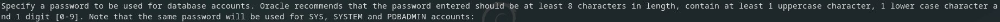

# Install_Oracle-Database-XE_Debian

Esto es un repositorio con el cual se facilita la instalación de Oracle Database 21c Express Edition en sistemas operativos basados en Debian.

## Instalación

```bash
git clone https://github.com/f1rul4yx/Install_Oracle-Database-XE_Debian.git
cd Install_Oracle-Database-XE_Debian
bash launch.sh
```

Cuando aparezca lo mismo que en la siguiente imagen ten paciencia porque tarda más o menos 30 minutos.


Cuando aparezca lo mismo que en la siguiente imagen se debe escribir la contraseña para el administrador de oracle.


## Acceso a Oracle como administrador

- `sqlplus sys as sysdba`

## Configuración inicial para permitir la creación de usuarios en Oracle

- `ALTER SESSION SET "_ORACLE_SCRIPT"=true;`

## Pasos para crear un usuario y asignar permisos

- Crear usuario ---> `CREATE USER <<user>> IDENTIFIED BY <<password>>;`

- Permisos de todo ---> `GRANT ALL PRIVILEGES TO <<user>>;`

## Pasos para iniciar el servicio automáticamente

- `sudo crontab -e`

- Añadir la línea ---> `@reboot sudo systemctl restart oracle-xe-21c.service`

## Notas

- Cuando se hace una consulta con muchas columnas estas se solapan por lo que hay que ejecutar lo siguiente cada vez que se entre en el SGBD ---> `SET linesize 32767;` `SET pagesize 50000;`
